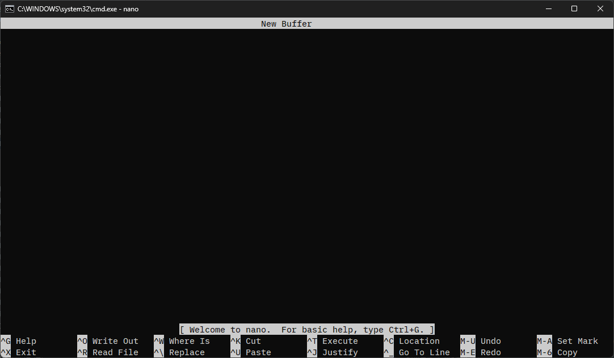

## nano.exeをダウンロードする
https://sourceforge.net/projects/nano-for-windows/

上記のリンクを開き、`Download`をクリックして`GNU-Nano_Win32(static).zip`をダウンロードする。
zipファイルを解凍して、任意のフォルダに`nano.exe`を配置する。
※日本語の入力には対応していない。(2024/03/31現在)

## 環境変数を設定する
コマンドプロンプトから`nano.exe`を使うためには、環境変数を設定する必要がある。

1. `Winキー` + `Rキー`を押して、`sysdm.cpl`と入力して`Enterキー`を押す。
2. `システムのプロパティ`の`システムのプロパティ`をクリックする。
3. `環境変数`をクリックする。
4. `システム環境変数`の`Path`を選択して`編集`をクリックする。
5. `新規`をクリックして、`nano.exe`のパスを追加する。
6. `OK`をクリックして、すべてのダイアログを閉じる。
7. コマンドプロンプトを再起動して、`nano`と入力して実行できるか確認する。

## nanoの使い方

`nano`と入力して実行すると、以下のような画面が表示される。

画面下にショートカットの説明が表示されています。

記号の意味は以下の通りです。

- `^`は`Ctrl`キーを表す。
- `M-`は`Alt`キーを表す。

保存して閉じるには、`Ctrl` + `S` を押下した後に、`Ctrl` + `X`を押下します。

## 参考
- [GNU nano](https://www.nano-editor.org/)