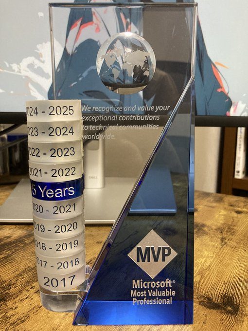

# Microsoft MVP（2024-2025）を再受賞しました

## 受賞理由
Microsoft MVP（Most Valuable Professional）は、
Microsoftの製品や技術に関する知識を持ち、
コミュニティに貢献している個人に贈られる称号です。
私は、Developer Technologiestというカテゴリー当分野で
Microsoftの製品や技術に関する記事を執筆したり、QAサイトで回答を投稿したり、
サンプルコードを公開したり、技術系のイベントで講演を行ったりして、コミュニティに貢献してきました。
そのことが称えられ、2024-2025でMicrosoft MVPを再受賞することができました。

## 今後の活動
今後も、Microsoftの製品や技術に関する情報を発信し、
コミュニティに貢献していきたいと思います。