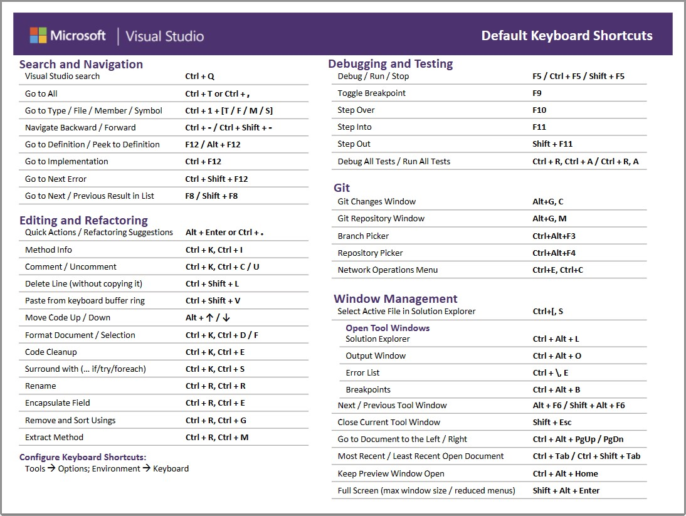

# Visual Studio ショートカット一覧

個人的によく使っている Visual Studio のショートカットを一覧にしました。
Visual Studio のショートカットは、キーボードの操作を覚えることで、効率的に開発作業を行うことができます。ぜひ活用してみてください。

※Visual Studio 2022 で確認しています。

| ショートカットキー                   | 説明                       |
|-----------------------------|--------------------------|
| `F1`                        | 選択した単語のヘルプを表示            |
| `F2`                        | ブックマークにジャンプ              |
| `Ctrl` + `F2`               | ブックマークを登録                |
| `Ctrl` + `Shif` + `F2`      | すべてのブックマークを削除            |
| `F5`                        | ビルドして実行(デバッグ実行）          |
| `Ctrl` + `F5`               | ビルドして実行(デバッグなし）          |
| `F7`                        | ビルド                      |
| `F9`                        | ブレイクポイントをカーソル行に付加        |
| `Ctrl` + `F9`               | カーソル行のブレークポイントを無効にする     |
| `Shift` + `Ctrl` + `F9`     | すべてのブレークポイントを削除          |
| `F10`                       | ステップオーバー                 |
| `F11`                       | ステップイン                   |
| `F12`                       | 定義にジャンプ                  |
| `Ctrl` + `D`                | カーソル行を複製                 |
| `Ctrl` + `X`                | 選択範囲がない場合、行の切り取り         |
| `Ctrl` + `Shift` + `]`      | カーソル部分のカッコに対応するカッコまで選択   |
| `Alt` + `上下矢印キー`            | カーソル行を上下に移動する            |
| `Alt` + `Shift` + `矢印キー`    | マルチカーソル/箱型選択             |
| `Ctrl` + `Tab`              | ソースコード/ウィンドウ表示切り替え       |
| `Ctrl` + `Shift` + `V`      | クリップボード履歴の表示             |
| `Ctrl` + `K` 後 `Ctrl` + `C` | カーソル行をコメントアウト            |
| `Ctrl` + `K` 後 `Ctrl` + `U` | カーソル行のコメントアウト解除          |
| `Ctrl` + `G`                | 行番号を指定してジャンプ             |
| `Ctrl` + `F`                | 検索                       |
| `Ctrl` + `Shift` + `F`      | グローバル検索                  |
| `Ctrl` + `H`                | 置換                       |
| `Ctrl` + `Shift` + `F`      | グローバル置換                  |
| `Ctrl` + `Tab`              | ソースコード/ウィンドウ表示切り替え       |
| `Ctrl` + `Space`            | 単語補完                     |
| `Ctrl` + `Alt` + `L`        | ソリューション エクスプローラ ウィンドウを開く |
| `Ctrl` + `Shift` + `E`      | リソース ビュー ウィンドウを開く        |
| `Ctrl` + `0` 後 `Ctrl` + `G` | Git コミットウィンドウを開く         |

## 参考

- [Visual Studio のキーボード ショートカット](https://learn.microsoft.com/ja-jp/visualstudio/ide/default-keyboard-shortcuts-in-visual-studio?view=vs-2022&utm_source=vshelp&wt.mc_id=visualstudio_inproduct_shortcuts_csaapp)

