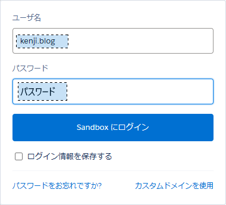
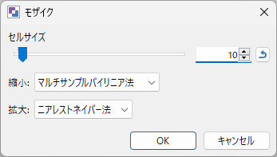
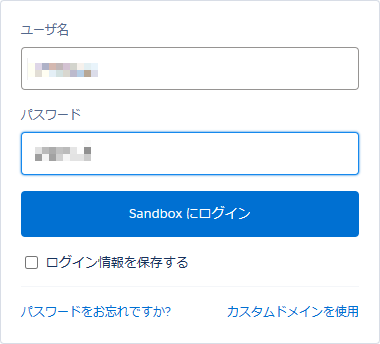

paint.netで画像の特定個所にモザイクをかける方法を紹介します。

ネット上に画像をアップロードする際に、画像の特定個所にモザイクをかけたい場合があると思いますが、
paint.netを使うとすぐに画像を加工することができます。

## 手順

#### 1. モザイク処理を行いたい画像をpaint.netで開く
#### 2. 選択ツールを使って、モザイクしたい部分を選択する（複数選択可能）

#### 3. メニュー＞エフェクト＞歪み＞モザイクを選択

- セルサイズでモザイク処理の粗さを設定します。数値が大きいほど隠匿性が高くなります。
- [縮小]`マルチサンプルバイリニア法`を選択
- [拡大]`ニアレストネイバー法`を選択

`OK`でダイアログを閉じます。

#### 4. 画像がモザイク加工されるので、画像を保存します。

以上。