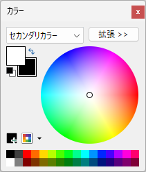

paint.netを使って画像に枠線をつける方法を紹介します。

## 手順

#### 1. 枠線を付けたい画像をpaint.netで開く
#### 2. セカンダリカラーを設定する（これが枠線の色になります）

カラーパレットが表示されていない場合は、キーボードの`F8`キーを押してください。

黒に設定する場合はをクリックしてください。

#### 3. メニュー＞画像＞キャンバスサイスを変更を選択

幅および高さをそれぞれ2ピクセルずつ増やします。2ピクセル増やすと枠線が1ピクセルになります。
枠線を5ピクセルにしたい場合は幅および高さをそれぞれ10ピクセルずつ増やします。

アンカーは「中央」を選択して、OKをクリック。

#### 4. 画像に枠線がつくので、画像を保存します。

以上。