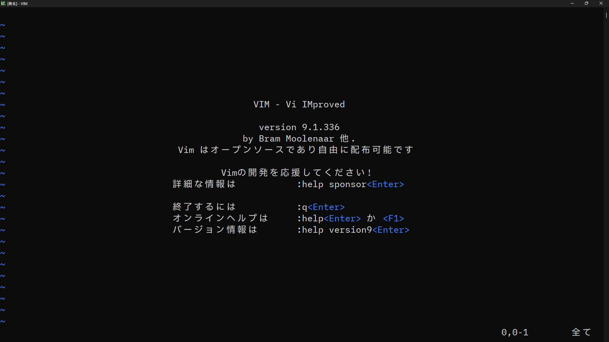

# vim入門

## ダウンロードとインストール

[https://www.vim.org/download.php](https://www.vim.org/download.php)

上記のサイトから、インストールしたいOSに合わせてモジュールをダウンロードおよびインストールします。

Windowsの場合は`gvim_X.X.X_x64_signed.exe`を選ぶとよいと思います。

##  起動方法

Windowsの場合は環境変数に`vim.exe`があるフォルダーをPathに登録しておく必要があります。

起動方法

```
vim
```

ファイル名を指定して起動する場合

```
vim filename.txt
```

## 終了方法

終了する場合は`:`(コロン)を入力後、`q`を入力して、Enterを入力
```
:q
```

ファイルを更新していた場合は`最後の変更が保存されていません（！を追加で変更を破棄）`と表示されます。
内容を破棄して強制的に終了することができます。
```
:q!
```

ファイルを書き込んで終了する場合は
```
:wq
```

下記でも同じ意味となります。
```
:x
```

また、`Shift`を押しながら`z`を2回押すことでも終了できます。（:wqと同じ）

## モード

vimには`コマンドモード`と`入力モード`があります。vimを起動した時点では、`コマンドモード`となり、`i`キーを押すと`入力モード`に移行します。

`入力モード`では文字通り入力が可能になります。`入力モード`から`コマンドモード`に移行するには`ESC`キーを押します。

この入力モードの切り替えがあるのが、vimの特徴となります。

## カーソル移動とスクロール

`コマンドモード`の際のカーソル移動とスクロールについてまとめます。

| キー                                 | 説明                      |
|------------------------------------|-------------------------|
| `h`（または`Ctrl`+`H`、`BackSpace`、`←`） | 左に移動                    |
| `j`（または`Ctrl`+`J`・`N`,`↓`）         | 下に移動                    |
| `k`（または`Ctrl`+`P`、`↑`）             | 上に移動                    |
| `l` （または`Space`、`→`）               | 右に移動                    |
| `+` （または`Enter`）                   | 次の行の先頭に移動               |
| `-`                                | 前の行の先頭に移動               |
| `Ctrl`+`B`（または`PageUp`）            | 上方向にスクロール               |
| `Ctrl`+`F`（または`PageDown`）          | 下方向にスクロール               |
| `Ctrl`+`U`                         | 上方向に半スクロール              |
| `Ctrl`+`D`                         | 下方向に半スクロール              |
| `Ctrl`+`Y`                         | 上方向に1行スクロール             |
| `Ctrl`+`E`                         | 下方向に1行スクロール             |
| `z` `Enter`                        | カーソル行を画面上部にスクロール        |
| `z` `.`                            | カーソル行を画面中央にスクロール        |
| `z` `-`                            | カーソル行を画面下部にスクロール        |
| `0`（または`\|`）                       | カーソルを行頭に移動              |
| `$`                                | カーソルを行末に移動              |
| `^`（または`_`）                        | カーソルを行頭（スペース、Tabを除く）に移動 |
| `G`（または`:$`）                       | カーソルを最終行に移動             |
| `:行番号` `Enter`                     | 指定行に移動                  |

`数字`の後上記の移動するキーを入力すると、数字の分、複数回移動できます。
(例えば、`3j`と入力すると現在のカーソル位置から下に3行移動します。)

## その他のコマンド

| キー         | 説明                   |
|------------|----------------------|
| `Ctrl`+`L` | 画面を再描画               |
| `Ctrl`+`G` | ファイル全体の行数、カーソル位置等を表示 |

