# いろんなバージョン情報ダイアログ集めてみた

## Windows 11
まずは今使っているWindows 11のバージョン情報です。

## IntelliJ IDEA (Community Edition)
このブログを書いている環境です。

## Visual Studio Code
こちらもよく使うエディタです。意外とシンプルです。

## Visual Studio
こちらはC++で使っている開発環境です。

## LINE(Windows)
こちらはLINEのWindows版です。

## Paint.NET
こちらは画像編集ソフトです。

## sakuraエディタ
こちらはテキストエディタです。

## Google Chrome
こちらはGoogle Chromeです。Edge登場後はあまり使わなくなりました。

## Firefox
こちらはFirefoxです。最近はあまり使っていません。
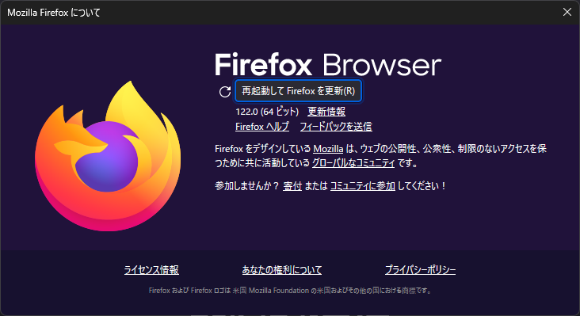

## Microsoft Edge
こちらはMicrosoft Edgeです。最近はこちらを使うことが多いです。

## OBS Studio
こちらはOBS Studioです。最近はあまり使っていません。
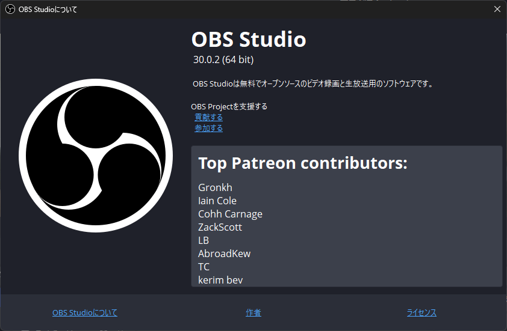

## TradingView
こちらはTradingViewです。最近はドル円のチャートを見るのに使っています。

## Spy++
こちらはSpy++です。Windows SDKに含まれているツールです。

## depency walker
こちらはdepency walkerです。Windows SDKに含まれているツールです。

## resource hacker
こちらはresource hackerです。実行ファイルのリソースを編集・取得するツールです。
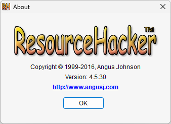

## Microsoft Excel
こちらはMicrosoft Excelです。
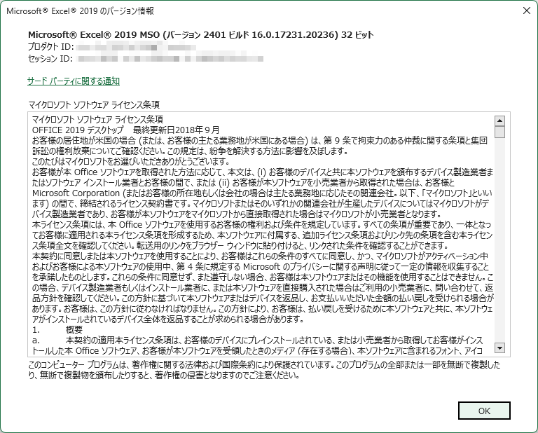

## bandy cam
こちらはbandy camです。動画キャプチャツールです。
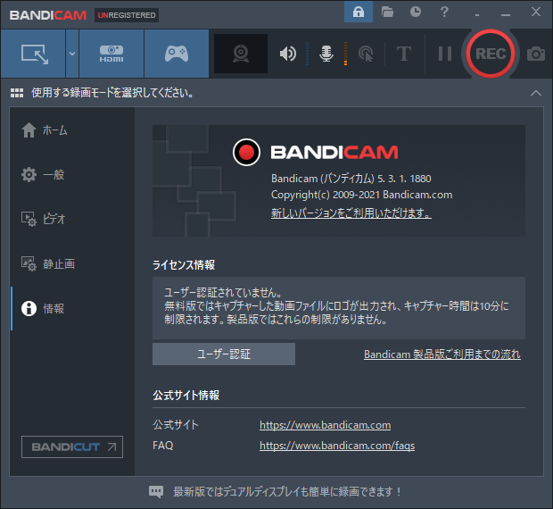

## winmerge
こちらはwinmergeです。ファイルの差分を見るツールです。
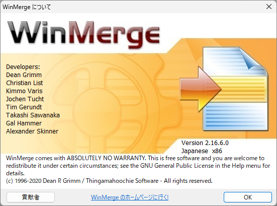

## iTunes
こちらはiTunesです。最近はあまり使っていません。
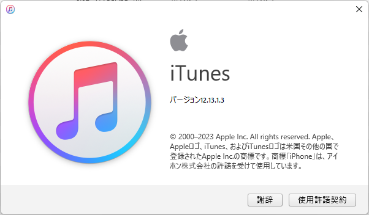

## 秀丸エディタ
こちらは秀丸エディタです。テキストエディタです。
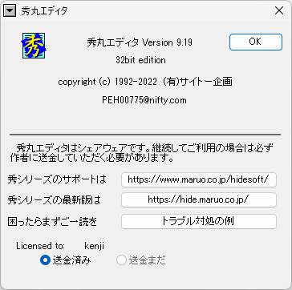

## Adobe Photoshop CS6
こちらはAdobe Photoshop CS6です。
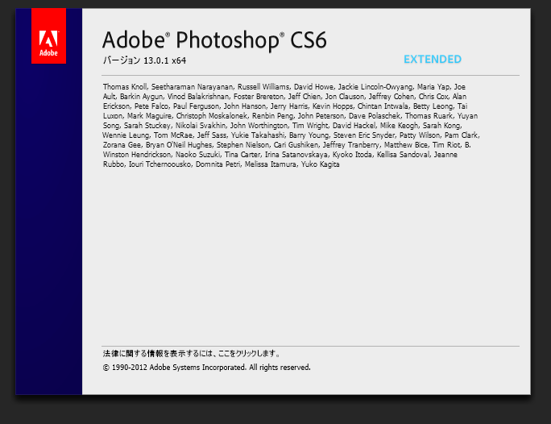

## Adobe Illustrator CS6
こちらはAdobe Illustrator CS6です。

## ESET NOD32
こちらはESET NOD32です。
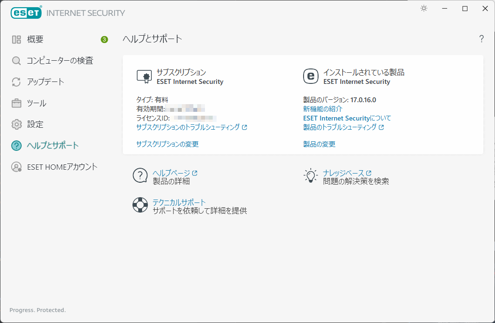

## NotePad++
こちらはNotePad++です。テキストエディタです。

## MIFES
こちらはMIFESです。最近はあまり使っていません。
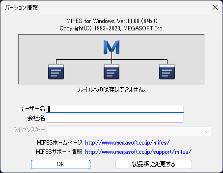
