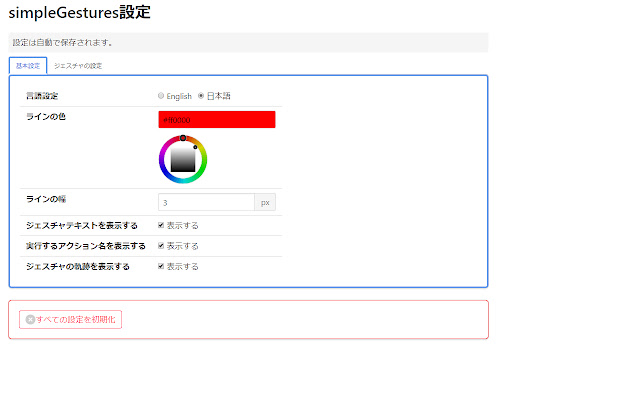
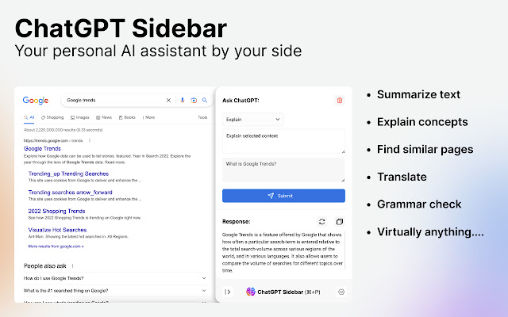

# おすすめのChorme拡張

現在使っているChorme拡張を紹介します。ChormeとはいえMicrosoft Edgeでも使えます。

## 1. simpleGestures

マウスジェスチャーを使えるようにする拡張です
キーボードを使ったりツールバーのボタンに合わせなくてもブラウザの操作ができます。

例えば、マウス右ボタンを押しながらマウスを左にスライドすると戻る、マウス右ボタンを押しながらマウスを右にスライドすると進む、などの操作ができます。

こちらもオープンソースのため信頼性が高いです。

- [simpleGestures](https://chrome.google.com/webstore/detail/simplegestures/flfminafiamnggnldfpilnfnmbgmiegn)
- [github](https://github.com/RyutaKojima/simpleGestures)

## 2. uBlock Origin

広告をブロックする拡張です。オープンソースのため信頼性が高い。また、CPUやメモリの使用量も少なく快適に動作します。

- [uBlock Origin](https://microsoftedge.microsoft.com/addons/detail/ublock-origin/odfafepnkmbhccpbejgmiehpchacaeak)
- [github](https://github.com/gorhill/uBlock/)

## 3. DeepL翻訳

世界的に有名な翻訳サービスDeepLを使ってページ内を翻訳できるChorme拡張です。ブラウザ上で翻訳させたい文章を選択すると、DeepLのアイコンが表示され、クリックすると自動翻訳されます。

- [DeepL Translator](https://chrome.google.com/webstore/detail/deepl-translate-reading-w/cofdbpoegempjloogbagkncekinflcnj?hl=ja)

## 4. ChatGPT Sidebar

ChatGPTをスライドバーで使えるようにするための拡張です。Ctrl+Pをでスライドバーを表示でき、すぐにAIに質問することができます。
ページ内で選択された文字列があればそのまま質問文にコピーされるためCtrl+Enterですぐに質問することができます。

- [ChatGPT Sidebar](https://chrome.google.com/webstore/detail/chatgpt-sidebar-support-g/difoiogjjojoaoomphldepapgpbgkhkb)

## 5. Salesforce DevTools

Salesforceの開発に便利な機能を追加する拡張です。
こちらはSalesforceを使っていない方には不要と思います。

- [Salesforce DevTools](https://chrome.google.com/webstore/detail/salesforce-devtools/ehgmhinnhggigkogkbhnbodhbfjgncjf)

