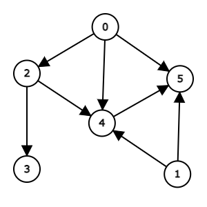

# グラフエディタ

簡単なグラフを作成することができるWebページの紹介です。

[https://csacademy.com/app/graph_editor/](https://csacademy.com/app/graph_editor/)

数値を入力してグラフを作成することができます。
また、マウスで要素の移動等もできるようです。

`Directed`をクリックすると有向グラフの作成もできます。

作成したグラフや`Download as PNG`で作成したグラフを画像として保存することができます。
