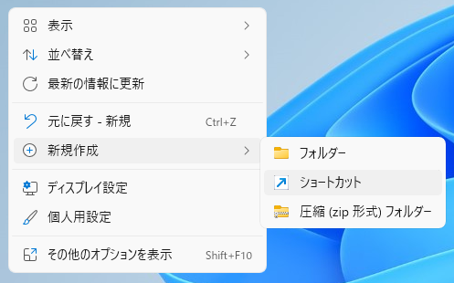
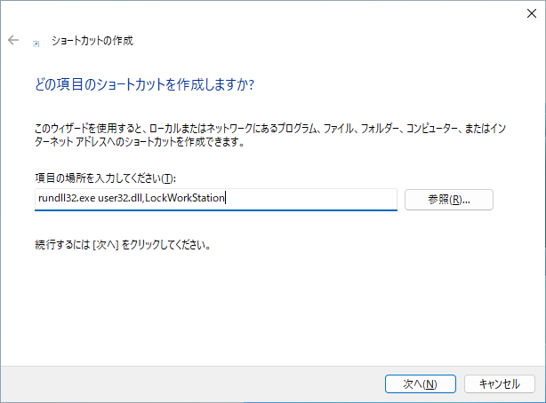
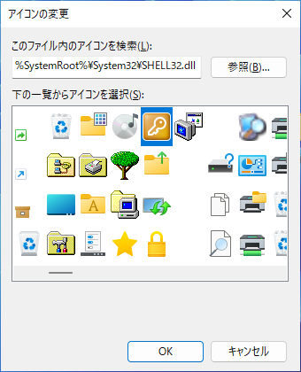

コンピューターをロックさせるショートカットを作成する方法を紹介します。

作成したショートカットをデスクトップなどにおいてダブルクリックするとコンピューターをロックできるので便利です。

## 作成方法

#### 1. デスクトップで右クリックして、`新規作成`＞`ショートカット`を選択

#### 2. ショートカットの作成画面が表示されるので`rundll32.exe user32.dll,LockWorkStation`を入力して`次へ`をクリック

#### 3. ショートカットの名前`コンピューターをロック`を入力して`完了`をクリック

#### 4. 作成されたショートカットのアイコンを変更する

作成されたショートカットを右クリックして`プロパティ`を選択

`アイコンの変更`をクリック

黄色の四角のアイコンを選択して`OK`をクリック、再度`OK`をクリックしてプロパティを閉じる

以上。

作成されたショートカットをダブルクリックするとコンピューターをロックされます。

`Winキー` + `Lキー`を押しても、同じくコンピューターをロックできます。

※注意：コンピューターをロックの確認ダイアログは表示されません。