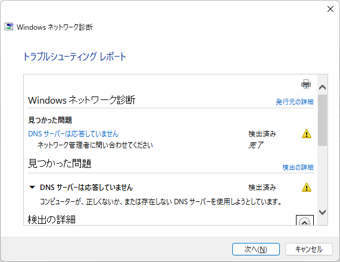

# 自宅のネット環境をフレッツ光からJ:COMに変更

知人からの紹介もあり、自宅のネット回線をフレッツ光からJ:COMに変えました。理由は,

1. 月々の料金が安くなる。3,619円→2,180円
2. インターネットのスピードが100MBpsから320MBpsに上がる

という点。

# 使ってみての感想
切り替えて1週間ほど立ちましたが、今のところほとんど問題はないです。下記に少し気になったところを記載します。

実際に変更して気づいたがダウンロードのスピードについては、確かに速くなり60MBpsだったのが320MBps弱はでるようになった。しかし、
アップロードスピードについては、フレッツ光の時は40MBpsは出ていたのが、10MBps程に下がった。これはどうもJ:COM側の仕様のようです。
今のところ配信を行ったり大量のデータをアップロードすることはないため、様子を見てみます。

あと、最近は家族ともテレワークがメインですが、本日はじめて数10分程度インターネットが不通となりました。自動的に復旧しましたが、
幸先があまりよくないかもです。まだ、切り替えてから1週間たっていないですが、、、。

余談ですが、J:COMはP2P通信を規制していることもありP2Pアプリの速度は出ないようです。P2Pを使用する方は注意したほうが良いです。

# サービスについて
契約時に、NetflixやDisney+に入会すると4万円分のQUOカードがもらえ、それぞれのサービス契約料と相殺されて少しだけ月々の料金が
平均で安くなるということで、契約と同時にサービス契約しました。Netflixは1年契約、Disney+は半年契約で自分で解約手続きをとる必要があるようです。

まだ切り替えて間もないので、使用感や感想が追加で出てきましたらまた記事を更新したいと思います。では、

# 09/06インターネットにつながりにくくなった
- 2022/09/06 13:13頃　3分から5分ぐらい
- 2022/09/06 13:30頃　3分から5分ぐらい
- その後何度か・・・

DNSが問題みたいなので、[ここ](https://internet.watch.impress.co.jp/docs/column/shimizu/1367271.html)を参考にDNSサーバを設定しました。
これでどうなるか・・・DNSの設定でも接続できない状態に陥ったので、サポートに問い合わせをしたところ、緊急のメンテナンスをしているとのこと・・・。問い合わせ直後から接続状態がよくなったので何かしら対策をしてもらえたと思います。
