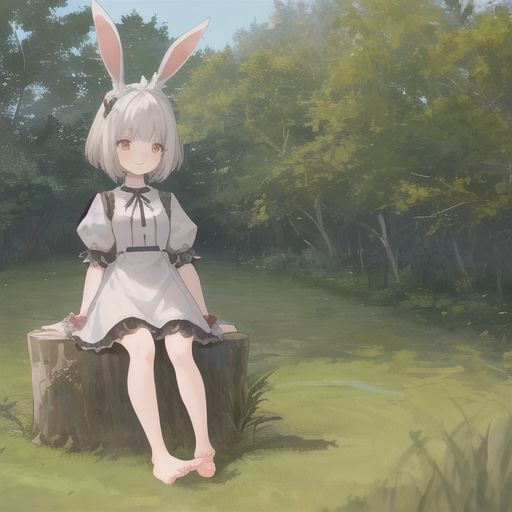

# Stable diffusionとは
Stable diffusionは、ドイツのミュンヘン大学の研究チームが開発した入力された文字情報から画像を生成するAIです。
様々な画像を学習させることで実写からイラストまで様々な画像を生成することができます。

今回は、Stable diffusionの学習済みデータを使ってイラスト画像を生成する方法を紹介します。

# 用意するもの

- Googleアカウント

のみとなります

# 生成手順

1. https://colab.research.google.com を開く
2. 左上の`ファイル`から`ノートブックを新規作成`を選択
3. `編集`から`ノートブックの設定`を選択
4. `ハードウェアアクセラレータ`を`GPU`に変更

5. 下記のコードを貼り付けて実行
```
!pip install diffusers==0.8.0 transformers
```
6. 下記のコードを貼り付けて実行
```
from diffusers import StableDiffusionPipeline
```
7. 下記のコードを貼り付けて実行
```
pipe = StableDiffusionPipeline.from_pretrained("gsdf/Counterfeit-V2.5")
pipe.to("cuda")
```
8. 下記のコードを貼り付けて実行
```
prompt = "((masterpiece,best quality)),1girl, solo, animal ears, rabbit, barefoot, knees up, dress, sitting, rabbit ears, short sleeves, looking at viewer, grass, short hair, smile, white hair, puffy sleeves, outdoors, puffy short sleeves, bangs, on ground, full body, animal, white dress, sunlight, brown eyes, dappled sunlight, day, depth of field"
n_prompt = "EasyNegative, extra fingers,fewer fingers"

image = pipe(prompt, negative_prompt = n_prompt).images[0]
image
```

ここで使用した`Prompt`は、[https://huggingface.co/gsdf/Counterfeit-V2.5](https://huggingface.co/gsdf/Counterfeit-V2.5)の`Prompt`を参考にしています。

## 生成結果


## 参考

- [https://huggingface.co/gsdf/Counterfeit-V2.5](https://huggingface.co/gsdf/Counterfeit-V2.5)
- [人工知能（AI）を使った画像生成プログラムを15分で作ってみた【実況プログラミング】](https://www.youtube.com/watch?v=l8-fVSM2PVQ)
