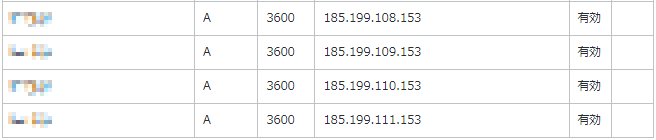

Githubリポジトリにカスタムドメインを設定するには、ドメインのDNS設定を変更する必要があります。
ここでは、お名前.comでドメインを管理していることを想定して説明します。
他のレジストラでもAレコードを書き換えることで同様の設定が可能です。

## お名前.comでDNSの設定を変更する
ドメインのDNSの設定を変更するには、お名前.comの管理画面にログインします。
ログイン後、ドメインの管理画面に移動します。
ドメインの管理画面に移動したら、DNS設定を変更します。
DNS設定を変更するには、以下のように設定します。
1. https://www.onamae.com/ にアクセスして「お名前.com Navi ログイン」をクリック
2. 「お名前ID（会員ID）」と「パスワード」を入力してログインボタンをクリック
3. 「ネームサーバーの設定」をクリック
4. 「ドメインのDNS設定」をクリック
5. 設定したいドメインを選択して「次へ」をクリック
6. 「DNSレコード設定を利用する」の右の「設定する」をクリック
7. TYPEにAを選択して、TTLに3600、VALUEに「185.199.108.153」と入力して「追加」をクリック
8. 7.と同様に「185.199.109.153」「185.199.110.153」「185.199.111.153」についても追加する
9. 「DNSレコード設定用ネームサーバー変更確認」でチェックがついていることを確認して「設定画面へ進む」をクリック
10. 「意図しないDNS設定変更を防ぐために」という画面が表示されたら「設定しない」をクリック（必要に応じて選択してください）
11. 設定内容を確認して「設定する」をクリック

12. これでDNS設定は以上となります。反映完了まで最大72時間程度かかる場合があります。
13. 72時間経っても反映されない場合は、お名前.comのサポートに問い合わせてみてください。

ローカルの環境で設定が反映されているか確認するには下記のコマンドを実行してみ見てください。
example.comの部分は、確認したいドメインに置き換えてください。

### Linux、Macの場合
```bash
dig example.com +noall +answer -t A
```
結果が次のようになっていれば、設定が反映されています。
```bash
example.com.              0       IN      A       185.199.108.153
example.com.              0       IN      A       185.199.109.153
example.com.              0       IN      A       185.199.110.153
example.com.              0       IN      A       185.199.111.153
```

### Windowsの場合
```bash
nslookup -q=a example.com 8.8.8.8
```
結果が次のようになっていれば、設定が反映されています。
```bash
サーバー:  dns.google
Address:  8.8.8.8

権限のない回答:
名前:    example.com
Addresses:  185.199.108.153
          185.199.109.153
          185.199.110.153
          185.199.111.153
```

## Githubリポジトリにカスタムドメインを設定する
1. リポジトリのページを開き、Settingsをクリックする
2. Pagesをクリックする
3. リポジトリのソースをそのまま公開する場合は、Sourceで「Deploy from a branch」を選択する。HUGOなどソースをビルドする場合は「GitHub Actions」を選択する。
4. Branchで公開するブランチを選択してSaveをクリックする
5. Custom domainに取得したドメインを入力して、Saveをクリックする。
6. 必要に応じて「Enforce HTTPS」にチェックを入れてHTTPS対応を行う

