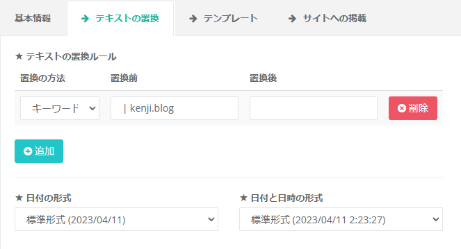

## はじめに

`Ranklet`というサービスを使うと、Googleアナリティクスから人気ページランキングを取得してページ内に簡単に配置できます。

## 動作イメージ


## 準備
- サイトにGoogleアナリティクスを設定していること

## 手順

1. `Ranklet`にアクセスする
2. `Sign in with Google`をクリックしてGoogleアカウントでログインする（Googleアナリティクスのアカウントと紐づけられていること）


`許可`をクリック

3. 基本情報を設定する


上記のように設定しました。

- `Google Analytics ビュー`ではランキングを取得したいビューを選択します。

4. テキストの置換を設定する


上記のように設定しました。
ページタイトルの` | kenji.blog`を削除するために設定しています。

5. テンプレートを設定する

- HTML(ランキングの数字を非表示にしました)

```
<div class="ranklet ranklet-reset">
    <table class="ranklet-table">
        <tbody class="ranklet-pages">
            {{#context.pages}}
            <tr class="ranklet-page">
                <td class="ranklet-image">
                    {{#image}}
                    <a href="{{url}}" class="ranklet-link">
                        
                    </a>
                    {{/image}}
                </td>
                <td class="ranklet-meta">
                    <div class="ranklet-title">
                        <a href="{{url}}" class="ranklet-link">
                            {{title}}
                        </a>
                    </div>
                    {{#description}}
                    <div class="ranklet-description">
                        <a href="{{url}}" class="ranklet-link">
                            {{description}}
                        </a>
                    </div>
                    {{/description}}
                </td>
            </tr>
            {{/context.pages}}
        </tbody>
    </table>
</div>
```

- CSS(フォントサイズを変更、説明文を3行で表示されるようにしました)

```
#ranklet-{{context.id}} {
    .ranklet-reset { // リセット
        table, tr, td, div, span {
            margin: 0;
            padding: 0;
            border: 0;
            font-size: 100%;
            font: inherit;
            vertical-align: baseline;
            line-height: 1;
            box-sizing: border-box;
        }
    }

    .ranklet-table {
        border-collapse: separate;
        border-spacing: 8px 24px;
        width: 100%;
        word-break: break-all;

        td {
            vertical-align: middle;
        }

        .ranklet-rank {
            text-align: center;
            font-size: 120%;
        }

        .ranklet-image {
            text-align: center;
            img {
                max-width: 128px;
                max-height: 128px;
            }
        }

        .ranklet-meta {
            .ranklet-title {
                font-size: 20px;
                line-height: 125%;
            }

            .ranklet-description {
                font-size: 16px;
                margin-top: 8px;
                line-height: 125%;
                display: -webkit-box;
                overflow: hidden;
                -webkit-box-orient: vertical;
                -webkit-line-clamp: 3; /* 行数 */
            }
        }
    }
}
```

- JavaScriptは変更なし

6. サイトへの掲載よりHTMLをコピーする


表示されているHTMLをコピーする

7. HUGOのテンプレートに貼り付ける

- `layouts/partials/ranklet.html`を作成し、コピーしたHTMLを貼り付ける
```
<div id="ranklet-11958"></div><script src="//widget.ranklet.com/v1/ranklet/s3/widgets/11958/widget.js"></script>
```

- `layouts/_default/single.html`の`</footer>`の前の行に下記のコードを貼り付ける
```
{{- partial "post_footer.html" . }}
```

以上です。これでこのページ下のようににランキングが表示されます。