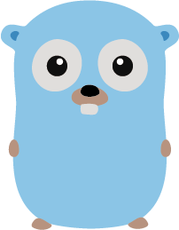
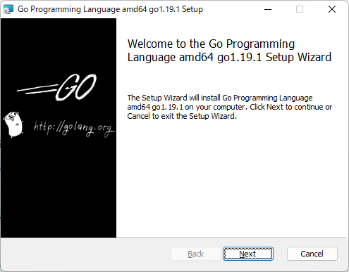
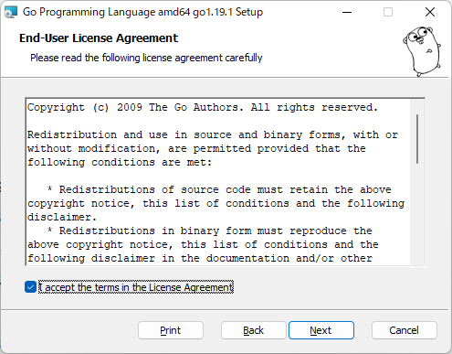
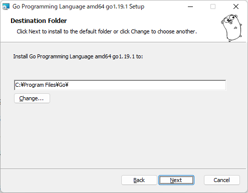
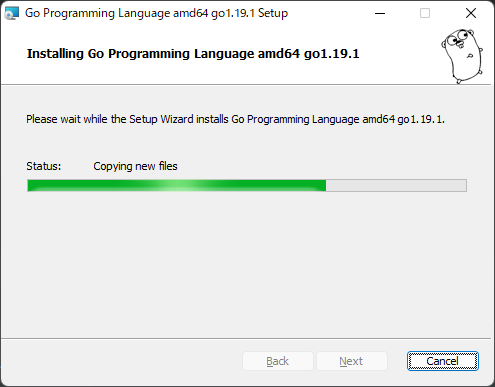
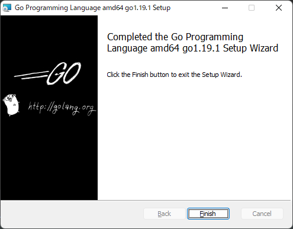

######イラスト作者(Renée French)

# はじめに
Goは、Googleが2009年に公開した比較的新しいプログラミング言語です。
Goのコンパイラ、ツール、ライブラリは、オープンソースで公開されています。
また、Goは、C言語やJavaのような静的型付け言語ですが、C言語のようなポインタを使わない言語です。

# インストール方法

[Go をインストール](https://go.dev/dl/)

上記サイトから各プラットフォーム向けにインストーラが公開されています。

画面にしたがってインストールを進めていきます。











インストール完了しました。簡単ですね。

# 初めてのプログラム

次のプログラムを`hello.go`として保存します。

```
package main

import "fmt"

func main() {
  fmt.Printf("Hello World\n")
}
```

コマンドプロンプトまたはターミナルから`go run hello.go`を実行すると、`Hello, world!`と出力されます。

コンパイルする場合は、`go build hello.go`を実行すると、`hello.exe`が生成されます。
`hello.exe`を実行すると、`Hello, world!`と出力されます。

# Webページでコードを実行することもできます

[https://go.dev/play/](https://go.dev/play/)


# 日本語ドキュメント

[http://go.shibu.jp/](http://go.shibu.jp/)

Goを学ぶうえで必要となる解説は上記のリンク（日本語訳版）に集約されています。
Goに関連する技術はオープンなので紙のテキストを購入する必要がないくらい充実しています。

それでは楽しいGoライフを！