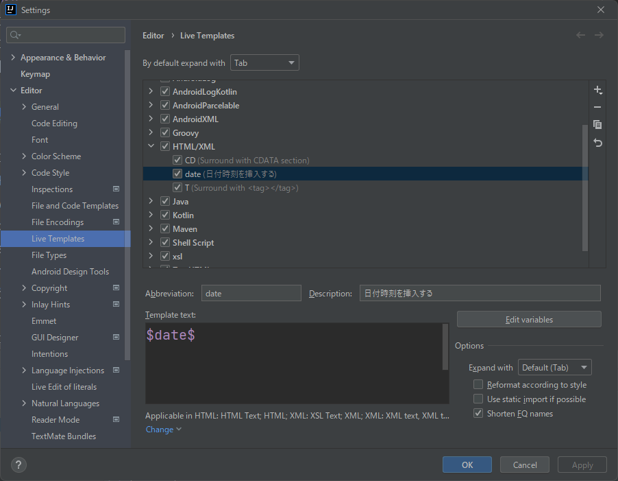
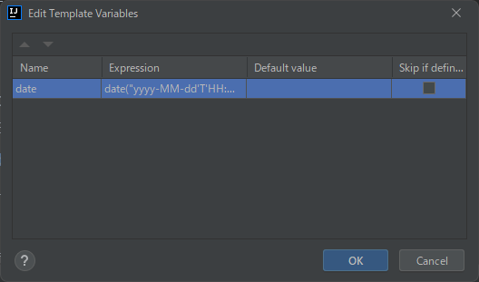

# はじめに
このブログを書くときは、IntelliJ IDEAを使っています。Gitとの相性も良いし、マークダウンのプロビューを表示してくれるから便利です。
毎回ブログを書く際にmdのヘッダーにdateを記述しなければならないので、その日付挿入のショーカットはないみたいなので、下記のサイトを参考に
日付を挿入するコマンドを作成してみました。参考になりましたら幸いです。

[Is there a shortcut for inserting date/time in IntelliJ IDEA?](https://stackoverflow.com/questions/8714779/is-there-a-shortcut-for-inserting-date-time-in-intellij-idea)

# 設定手順
1. メニューの「File」>「Settings...」を開く  
   
2. 「HTML/XML」を選択した状態で「+」をクリック
3. Live Templateを選択
4. Abbreviationに「date」を入力
5. Descriptionに「日付時刻を挿入する」を入力
6. Template Textに「$date$」を入力
7. Edit Variablesボタンをクリック  
   
8. Nameに「date」を入力
9. Expressionに「date("yyyy-MM-dd'T'HH:mm:ss'+09:00'")」と入力
10. OKでダイアログを閉じる
11. DefineまたはChangeを押して「Everywhere」にチェックをつける
12. OKでダイアログを閉じる
13. コードエディタで「date」と入力してEnterで日付が挿入されたら設定完了！

IntelliJ IDEAはまだ経験が浅いので技を見つけたらまた公開していきたいと思います！