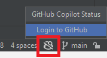
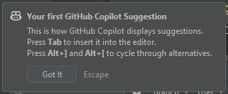

# はじめに
GitHub Copilotは、GitHubが開発したAIベースのコード補完ツールです。
開発環境IntelliJ IDEAにGitHub Copilotのプラグインを入れるとIntelliJ IDEAでもGitHub Copilotを使うことができます。
有効化するにはGithubのアカウントが必要となります。

# インストール方法
1. IntelliJ IDEAのメニューのFileからSettingsを選択
2. Pluginsを選択して、検索で「GitHub Copilot」を検索

3. インストールボタンからインストール

4. Restart IDEボタンを押してIntelliJ IDEAを再起動

IntelliJ IDEAを再起動するとインストールは完了です。

# 有効化
1. 右下のアイコンをクリック
2. Login to Githubをクリック

3. Copy and Openボタンをクリック

4. ブラウザが立ち上がるので、Githubにログインしていない場合はログインしたのち、Ctrl+Vでコードを貼り付けてContinueボタンをクリック

5. Authorize GitHub Copilot Pluginボタンをクリック

上記の画面が表示されれば有効化完了です。

# 使ってみる

IntelliJ IDEAのエディタで文字を数文字入力すると、GitHub Copilotがコードの続きを提案してくれるようになります。
これは便利ですよね！
