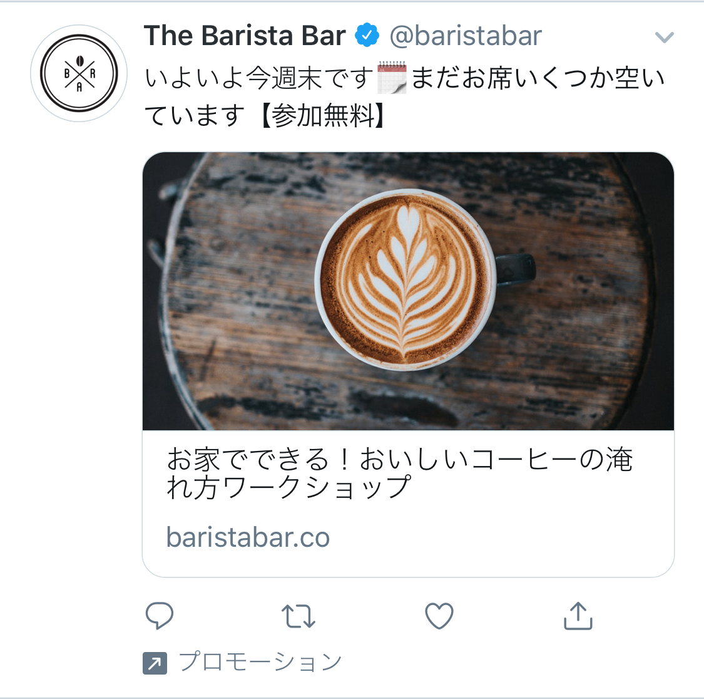

# はじめに
PaperModテーマはTwitter Cardに対応しています。
ただし、Twitter Cardの設定は、`config.toml`まはた各記事の`*.md`のヘッダ情報に記述する必要があります。
各記事と`config.toml`の両方に設定した場合は、各記事のヘッダ情報が優先されます。

# 設定方法
## config.toml
`config.toml`には、`[params]`の下に、`images`という項目を追加します。
`images`には、Twitter Cardに表示する画像のパスを記述します。
画像を`static`フォルダに配置する場合は、ファイル名だけの指定でOKです。

```toml
[params]
dateFormat= "2006.1.2(Mon)"
images = ["twitter_card.jpg"]
```
### 各記事のヘッダ情報
各記事のヘッダ情報には、`cover`の配下に`image`という項目を追加します。
`relative`を`true`にすると、記事の`*.md`からの相対パスで指定できます。

```md
cover:
  image: "images/cover.jpg"
  relative: true
```

### 画像のサイズについて
Twitter Cardの画像サイズは、`summary_large_image`の場合は、`1200x630`、`summary`の場合は、`600x300`です。
画像のサイズが違うと、Twitter Cardの表示が崩れることがあります。
できれば、画像サイズをリサイズして投稿することをおすすめします。

### 設定の確認方法
Twitter Cardの設定を確認するには、[Twitter Card Validator](https://cards-dev.twitter.com/validator)を利用します。
ただし、私の環境ではうまくプレビューが表示されなかったため、非公開のアカウントを使って投稿前に一度確認することをおすすめします。

