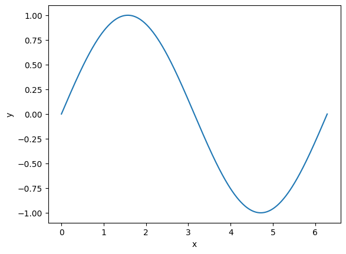

# 必要なもの
- Google アカウント

# 手順

1. [https://colab.research.google.com/](https://colab.research.google.com/) にアクセス
2. 「ファイル」→「ノートブックを新規作成」を選択
3. 下記のコードを貼り付けて実行
```python
import matplotlib.pyplot as plt
import numpy as np
x = np.linspace(0, 2*np.pi, 500)
plt.plot(x,np.sin(x))
plt.xlabel('x')
plt.ylabel('y')
plt.show()
```

# 実行結果



# 参考

- [matplotlib.pyplot — Matplotlib 3.5.3 documentation](https://matplotlib.org/3.5.3/api/_as_gen/matplotlib.pyplot.html)