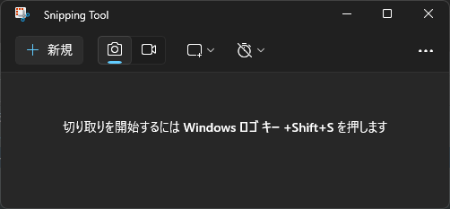

## Snipping Toolとは
Snipping Toolは、Windowsに標準搭載されているスクリーンショットツールです。画面の一部を切り取って保存したり、画面全体をキャプチャーしたり、録画したりすることができます。

## Snipping Toolの起動方法

- `Winキー`を押して、`Snipping Tool`と入力して`Enterキー`を押す。
- `Winキー` + `Shift` + `Sキー`を押す。
- `Winキー` + `Rキー`を押して、`snippingtool`と入力して`Enterキー`を押す。

## Snipping Toolの使い方

### キャプチャー画像を保存する方法は以下の通りです。

1. `カメラ`マークを選択する。
2. `新規`ボタンをクリックする
3. キャプチャーしたい範囲を選択する。
4. `名前を付けて保存`ボタンをクリックする。
5. 保存先とファイル名を入力して保存する。

### キャプチャー動画をコピーする方法は以下の通りです。

1. `ビデオ`マークを選択する。
2. `新規`ボタンをクリックする
3. キャプチャーしたい範囲を選択する。
4. `スタート`ボタンをクリックする。
5. 画面録画する
6. `停止`ボタンをクリックする。
7. `名前を付けて保存`ボタンをクリックする。
8. 保存先とファイル名を入力して保存する。

## 参考

- [Snipping Tool を使ってスクリーン ショットをキャプチャする](https://support.microsoft.com/ja-jp/windows/snipping-tool-%E3%82%92%E4%BD%BF%E3%81%A3%E3%81%A6%E3%82%B9%E3%82%AF%E3%83%AA%E3%83%BC%E3%83%B3-%E3%82%B7%E3%83%A7%E3%83%83%E3%83%88%E3%82%92%E3%82%AD%E3%83%A3%E3%83%97%E3%83%81%E3%83%A3%E3%81%99%E3%82%8B-00246869-1843-655f-f220-97299b865f6b)