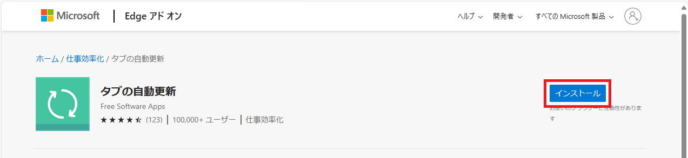
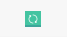
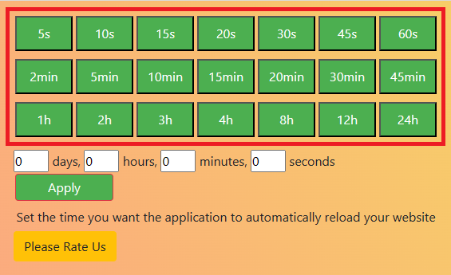
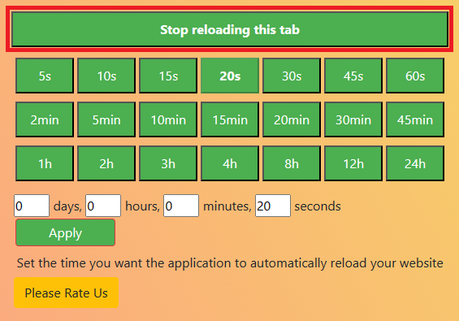

Webページを自動更新するEdgeのブラウザ拡張機能「タブの自動更新」を紹介します。

## タブの自動更新のインストール

[タブの自動更新](https://microsoftedge.microsoft.com/addons/detail/%E3%82%BF%E3%83%96%E3%81%AE%E8%87%AA%E5%8B%95%E6%9B%B4%E6%96%B0/bicjibdndeejemialpbohjpiimehbapb)

上記のサイトにアクセスし、`インストール`をクリック。

`拡張機能の追加`をクリック。

## 使い方

インストールが完了すると、Edgeの右上にアイコンが追加されます。

自動更新したいWebページを開き、アイコンをクリックすると、自動更新が開始されます。

緑枠の部分が自動更新される間隔です。自動更新するタイミングを選択してください。

自動更新を停止する場合は、アイコンをクリックして`Stop reloading this tab`をクリックします。

