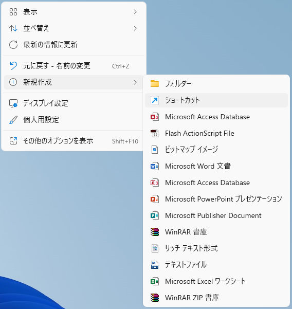
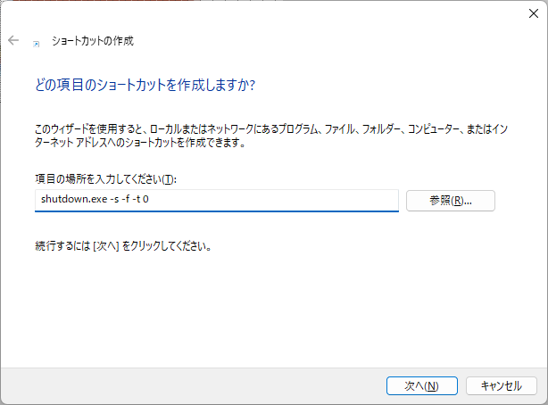
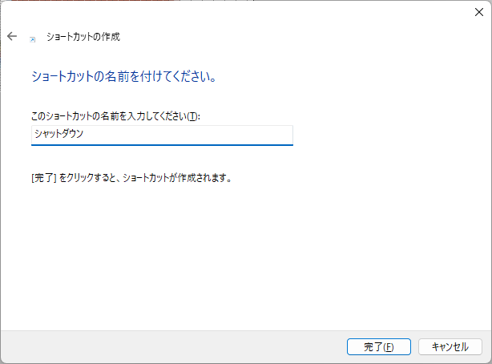

Windowsをシャットダウンさせるショートカットを作成する方法を紹介します。

作成したショートカットをデスクトップなどにおいてダブルクリックするとシャットダウンできるので便利です。

## 作成方法

#### 1. デスクトップで右クリックして、`新規作成`＞`ショートカット`を選択

#### 2. ショートカットの作成画面が表示されるので`shutdown.exe -s -f -t 0`を入力して`次へ`をクリック

#### 3. ショートカットの名前`シャットダウン`を入力して`完了`をクリック

以上。

作成されたショートカットをダブルクリックするとWindowsがシャットダウンされます。

※注意：シャットダウンの確認ダイアログは表示されません。
