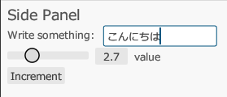

## eguiのサンプルを取得

下記のコマンドで、eguiのサンプルを実行できます。

```
git clone https://github.com/emilk/eframe_template/ egui_test
cd egui_test
cargo run
```

## 日本語対応フォントを読み込む

日本語を表示するには日本語の対応フォントを読み込む必要があります。

`src/app.rs`の中で`pub fn new`メソッドの中に下記の行を追加します。

```rust
// 日本語対応フォントを読み込む
let mut fonts = egui::FontDefinitions::default();
fonts.font_data.insert(
    "Meiryo".to_owned(),
    egui::FontData::from_static(include_bytes!("C:/Windows/Fonts/Meiryo.ttc")),
);
fonts
    .families
    .entry(egui::FontFamily::Proportional)
    .or_default()
    .insert(0, "Meiryo".to_owned());
cc.egui_ctx.set_fonts(fonts);
```

## これで日本語を表示できるようになります。

