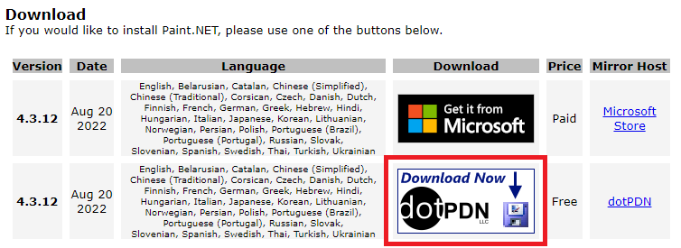

わたしが開発の作業を行う中でよく使う画像編集ソフトpaint.netの紹介します。

# Windows標準のペイントではできないことができる
- 透過率を扱うことができる
- 複雑な範囲形の自動選択ができる
- レイヤーを扱うことができる
- レベル補正、明度、コントラストの調整ができる
- 様々なエフェクト（ぼかし、ゆがみ、ノイズ等）

# その他特徴
- 動作が比較的軽い
- 無償で使える
- 直感的に使えて癖があまりない
- 日本語（多言語対応）

とっても高機能だけど使いやすいソフトです。全部の機能はまだ使いこなせていません。

# インストールはこちら
[https://www.getpaint.net/download.html](https://www.getpaint.net/download.html)

無償版を選択する場合はリンク先のボタンをクリックしてください。

Microsoft Store経由でインストールすると有償となる代わりに自動アップデートができるようになるようです。
無償版でも、最新が更新情報を教えてくるので割とスムーズにアップデートできます。