# いろんなバージョン情報ダイアログ集めてみた

## Windows 11
まずは今使っているWindows 11のバージョン情報です。
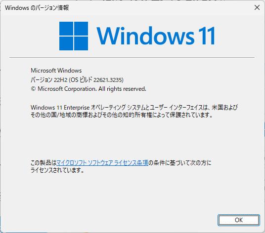

## IntelliJ IDEA (Community Edition)
このブログを書いている環境です。
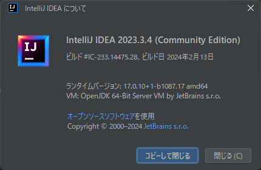

## Visual Studio Code
こちらもよく使うエディタです。意外とシンプルです。
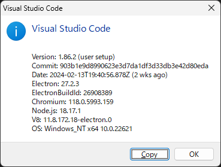

## Visual Studio
こちらはC++で使っている開発環境です。
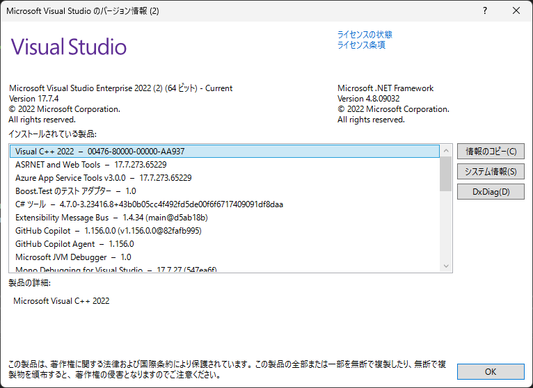

## Line(Windows)
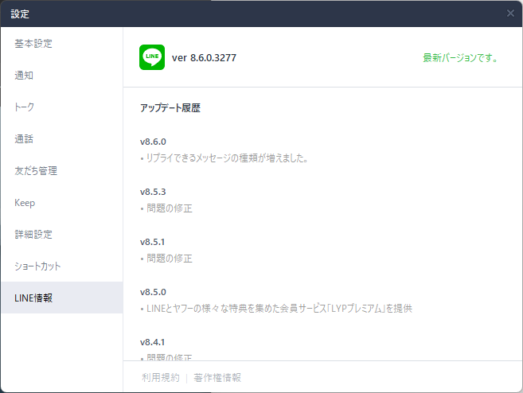

## Paint.NET
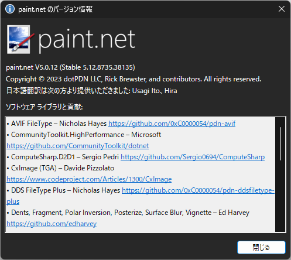

## sakuraエディタ
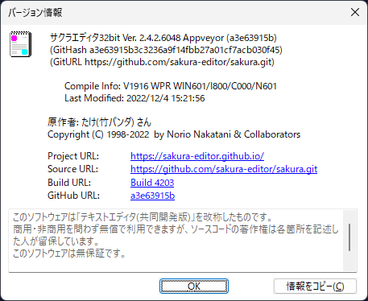

## chrome
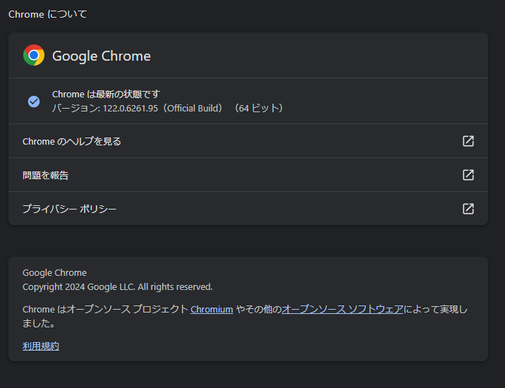

## firefox

## Edge
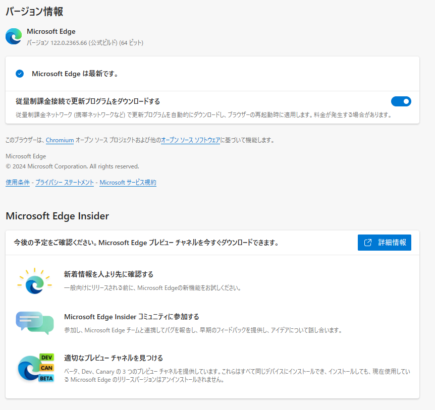

## obs studio

## TradingView
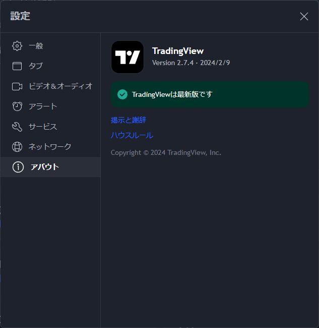

## spy++

## depency walker
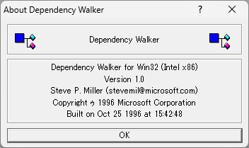

## resource hacker

## Microsoft Excel

## bandy cam

## winmerge

## iTunes

## 秀丸エディタ

## Adobe Photoshop CS6

## Adobe Illustrator CS6
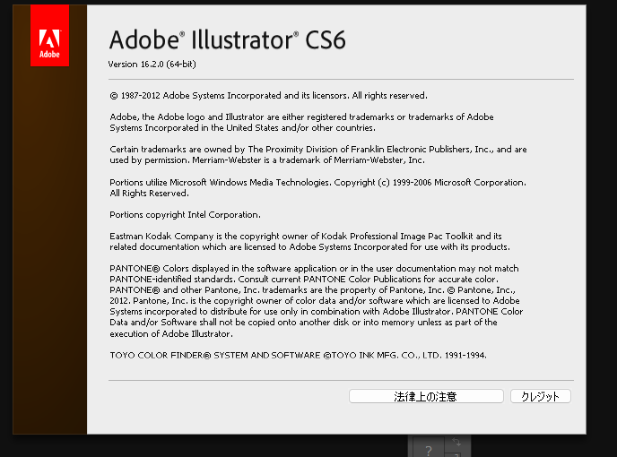

## ESET NOD32

## NotePad++
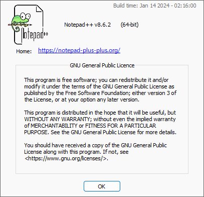