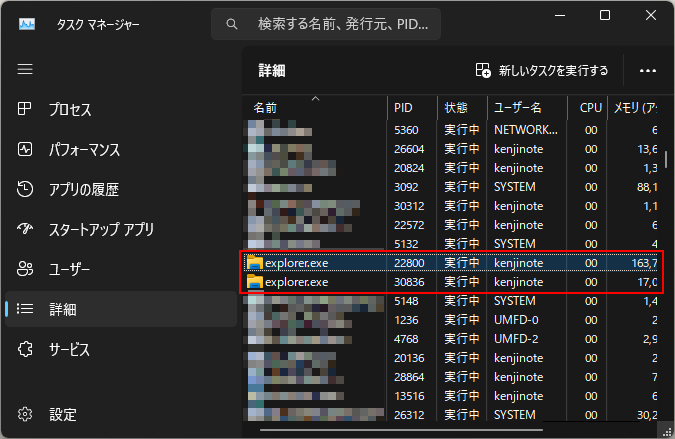

## タスクバーの右クリックから終了する方法

こちらはWindows 10での方法です。Windows 11ではメニューが表示されないようです。
タスクバーでShiftキーとCtrlキーを押しながら右クリックをすると、メニューに「エクスプローラーの終了」が表示されます。

## タスクマネージャーから終了する方法

1. Ctrl + Shift + Esc キーを押してタスクマネージャーを起動します。
2. プロセスタブを選択します。

3. `explorer.exe` を選択し、Deleteキーを押下し、`explorer.exe を終了しますか？`と聞かれるので、`プロセスの終了`を選択します。

## コマンドプロンプトから終了する方法

1. Win + R キーを押して、`cmd` と入力し、Enterキーを押します。
2. `taskkill /f /im explorer.exe` と入力し、Enterキーを押します。

## タスクマネージャーからエクスプローラを起動する方法

1. Ctrl + Shift + Esc キーを押してタスクマネージャーを起動します。
2. ファイルメニューから、`新しいタスクの実行`を選択します。
3. `explorer.exe` と入力し、Enterキーを押します。