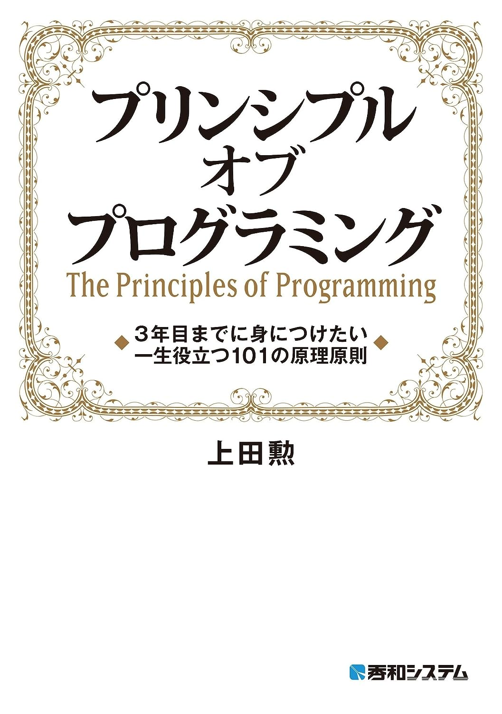
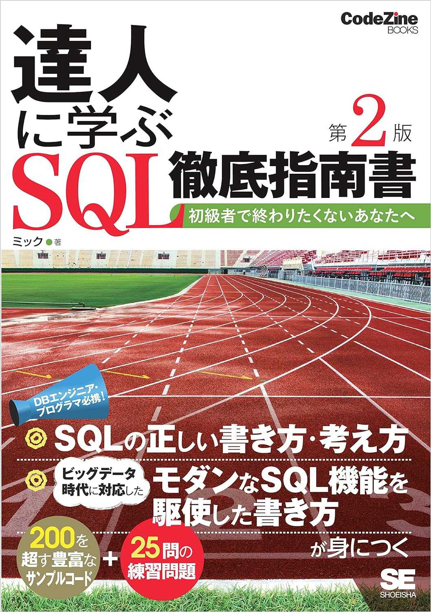
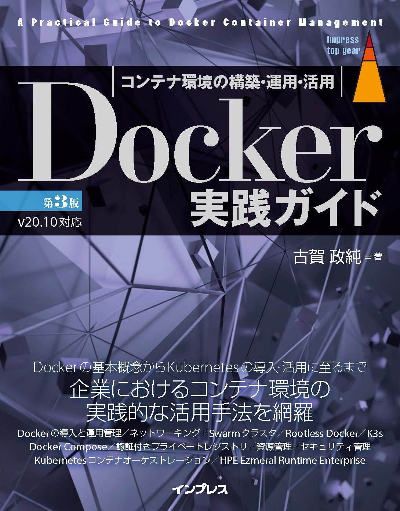
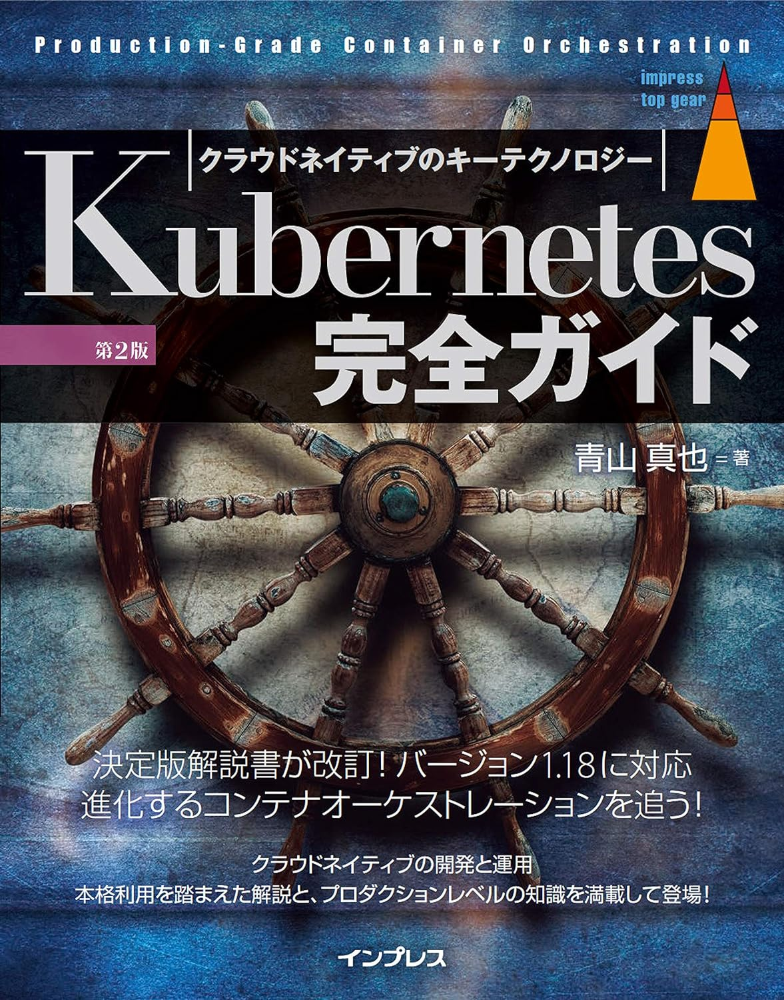
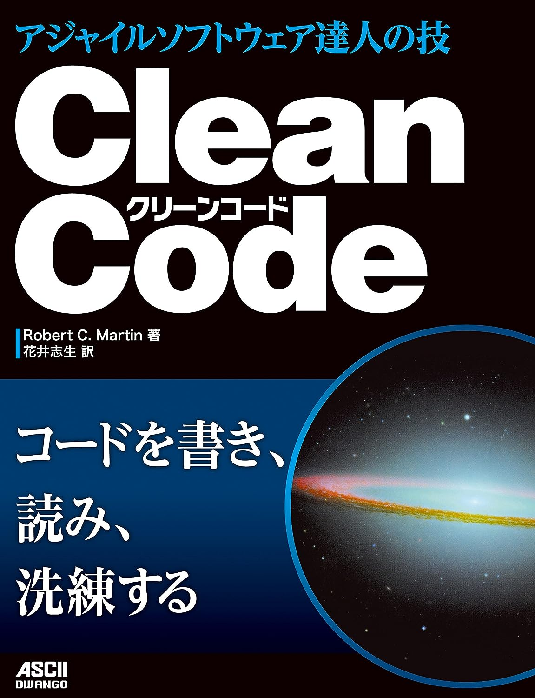
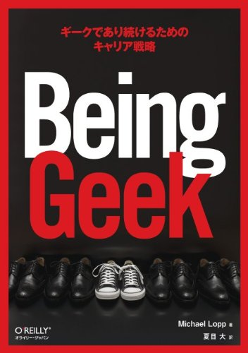

1. リーダブルコード

2. プリンシプルオブプログラミング

3. 達人プログラマー

4. Webを支える技術

5. 安全なWebアプリケーションの作り方

7. ネットワークはなぜつながるのか

7. 達人に学ぶSQL徹底指南書

8. Docker実践ガイド

9. Kubernetes完全ガイド

10. CODE COMPLETE 第2版

11. Clean Code アジャイルソフトウェア達人の技

12. Clean Architecture 達人に学ぶソフトウェアの構造と設計

13. ゲームプログラマになる前に覚えておきたい技術

14. Being Geek

