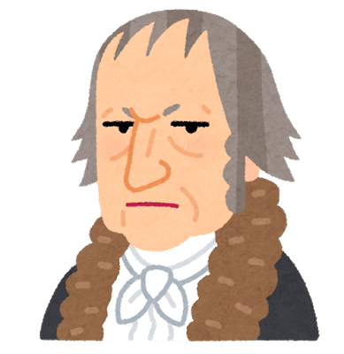

##ヘーゲルの弁証法とは
> ヘーゲルは理性の陥る矛盾の積極的な意義をとらえて，一般に有限なものはすべて自己に内在する矛盾を動因として対立物を生み出し，それを媒介としてともにより高次の段階へ止揚されると主張し，これを現実世界の一切の運動の原理とした。
> コトバンクより

わたしの解釈は、現実世界のあらゆる主義主張や考えは、ただ一辺倒に正しいということではなく、
内部に必ず矛盾をはらんでいて、その対立する構造を理解したり取り入れたりする中で、
より高いレベルに認識が発展していくということ。

これは、人の考え方だけではなく、自然界のあらゆる現象にも当てはまると思う。

物質は作用が働けば反作用が働く、物が動けば摩擦が働く、引力は太陽や地球だけでなくすべての物質どうし互いに影響しあっている。
川の流れも風の流れも、一方向に流れるだけではなく、様々な力を受けて、刹那で流れが変わっていく。

<!-- ##ヘーゲルの弁証法の例 -->

