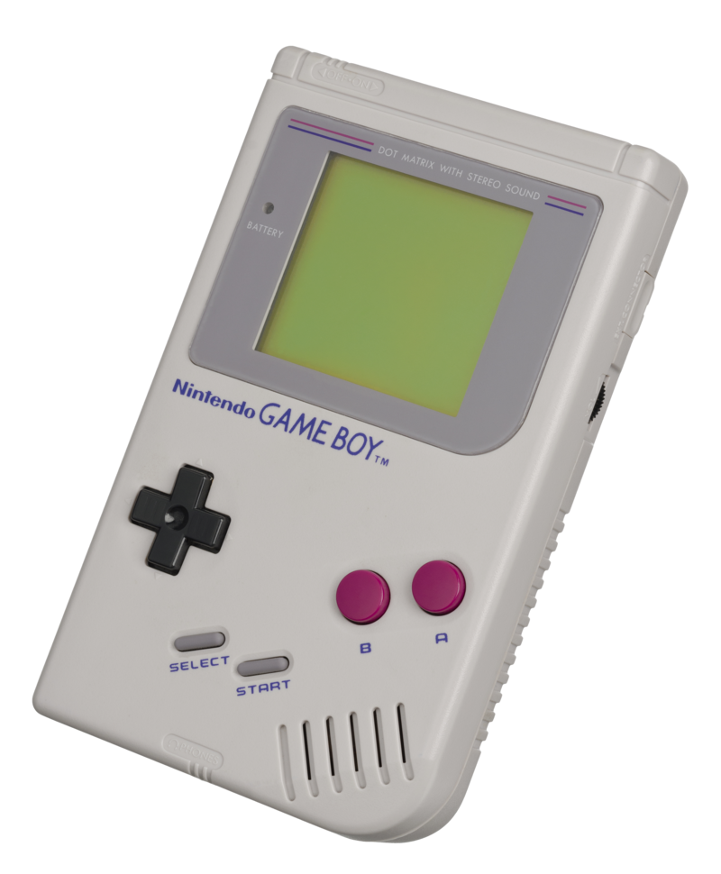
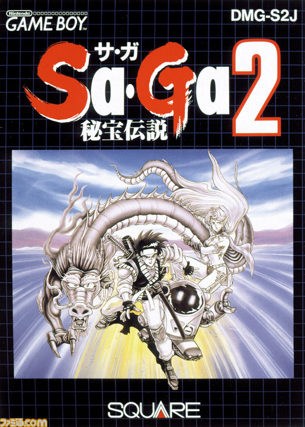
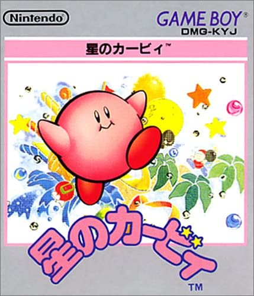
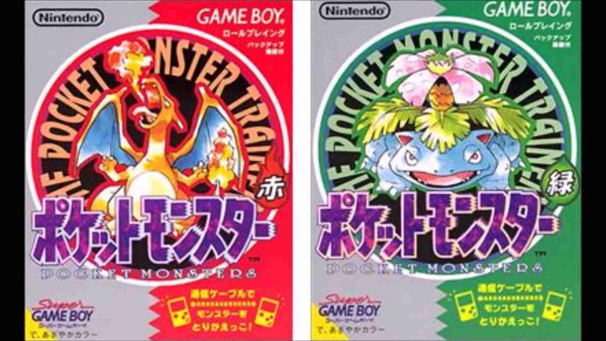
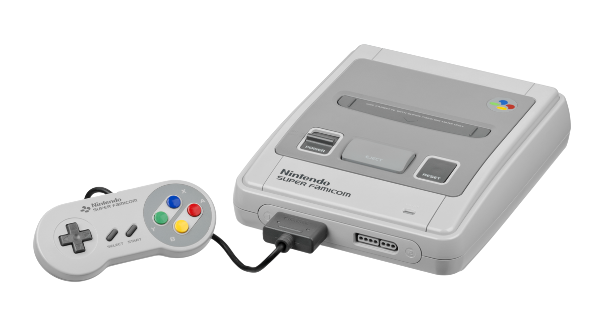
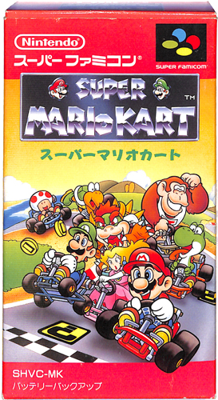
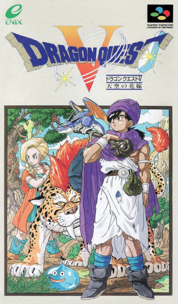
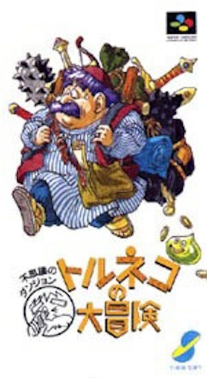
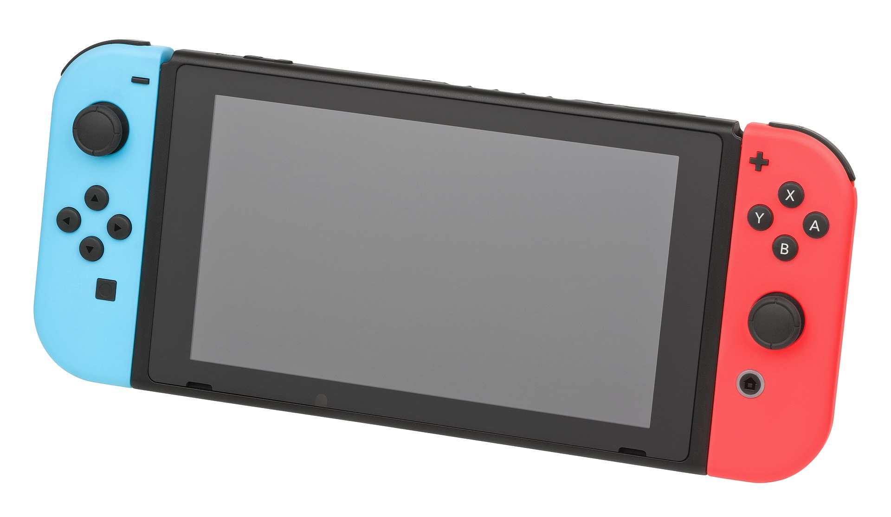

好きなゲーム考えたら殿堂入りばかりの10選になってしまった。
古いゲームが多いので遊んでない人はぜひ遊んでみてください。

## ゲームボーイ

初代ゲームボーイは、1989年に任天堂より発売された携帯型ゲーム機。
その後、ゲームボーイカラーやゲームボーイアドバンスなどの機種が発売されている。

### Sa・Ga2 秘宝伝説

1990年にスクウェア（現スクウェア・エニックス）より発売されたRPGゲーム。

### 星のカービィ

1992年に任天堂より発売されたアクションゲーム。開発元はHAL研究所。

### ポケットモンスター 赤・緑

1996年に任天堂より発売されたRPGゲーム。開発元は任天堂情報開発本部、ゲームフリーク、クリーチャーズ。
その後、アニメ化されて爆発的な人気が出ましたが、私は初代しか遊んだことがありません。

## スーパーファミコン

1990年に任天堂より発売された家庭用ゲーム機。海外ではSNES(Super Nintendo Entertainment System)とも呼ばれる。

### スーパーマリオカート

1992年に任天堂より発売されたスーパーファミコン用ソフト。
レーシングゲーム。

### ドラゴンクエストV 天空の花嫁

1992年にエニックスより発売されたRPGゲーム。

### ファイナルファンタジーV

1992年にスクウェアより発売されたRPGゲーム。

### トルネコの大冒険 不思議のダンジョン

1993年にチュンソフトより発売されたローグライクゲーム。
不思議のダンジョンシリーズの前身。
毎回ランダムにダンジョンのかたちが変わるのが特徴。
キャッチコピーは「1000回遊べるRPG」。

### 不思議のダンジョン2 風来のシレン

1995年にチュンソフトより発売されたローグライクゲーム。
不思議のダンジョンシリーズ『トルネコの大冒険』の続編。

### MOTHER2

1994年に任天堂より発売されたMOTHERシリーズ第2作目。開発元は、エイプとHAL研究所。
その後2006年にMOTHER3が発売されている。

### ゼルダの伝説 神々のトライフォース

1991年に任天堂より発売されたアクションアドベンチャーゲーム。
その後様々な続編が発売されている。（[参考](https://ja.wikipedia.org/wiki/%E3%82%BC%E3%83%AB%E3%83%80%E3%81%AE%E4%BC%9D%E8%AA%AC%E3%82%B7%E3%83%AA%E3%83%BC%E3%82%BA%E3%81%AE%E4%BD%9C%E5%93%81%E3%83%BB%E9%96%A2%E9%80%A3%E4%BD%9C%E5%93%81%E3%81%AE%E4%B8%80%E8%A6%A7)）

## ニンテンドースイッチ

2017年に任天堂より発売された家庭用ゲーム機。

### スプラトゥーン２

2017年に任天堂より発売されたアクションシューティングゲーム。
2022年には続編となるスプラトゥーン３が発売されている。

