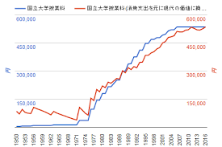
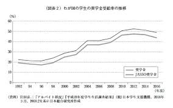

私が日本社会についておかしいなと思っていること・考えていることを整理しようと思う。

# 奨学金について
日本の奨学金といえばほとんどは、有利子で返さなくてはならないものになっています。
また、大学の学費は1950年からからずっと増加していて、受給率も直近を除けば増加傾向にあります。

最近の平均の借入総額は324万円に上るようです。

>日本学生支援機構の奨学金利用者において、平均の借入総額は324万3,000円。[参考](https://magazine.aruhi-corp.co.jp/0000-5086/#:~:text=%E5%80%9F%E5%85%A5%E7%B7%8F%E9%A1%8D%E3%81%AA%E3%81%A9%E3%81%AE%E5%B9%B3%E5%9D%87%E9%A1%8D%E3%81%AF&text=%E6%97%A5%E6%9C%AC%E5%AD%A6%E7%94%9F%E6%94%AF%E6%8F%B4%E6%A9%9F%E6%A7%8B%E3%81%AE%E5%A5%A8%E5%AD%A6%E9%87%91%E5%88%A9%E7%94%A8%E8%80%85%E3%81%AB%E3%81%8A%E3%81%84%E3%81%A6,%E4%BB%A5%E4%B8%8A%E3%82%92%E5%8D%A0%E3%82%81%E3%81%A6%E3%81%84%E3%81%BE%E3%81%99%E3%80%82)

大学を卒業する22歳の段階で300万円もの借金を背をわせていれば、当然婚期も遅くなるだろうし、子供も産みにくくなるのは当然で日本の少子化問題の一因となっていると思う。

（記事を追記・更新します・・・）