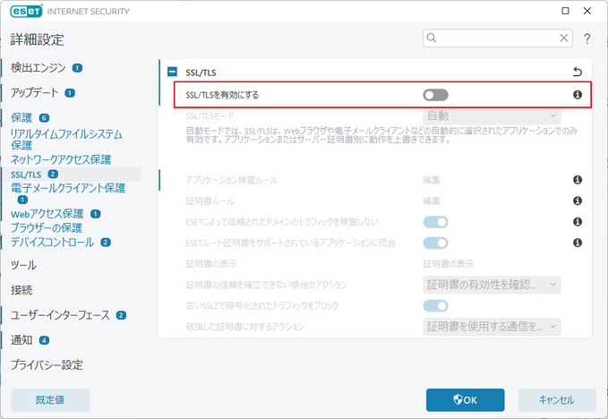

# GitHub Copilotで下記のエラーが表示された場合の対処方法

```
[ERROR] [ghostText] [2024-04-21T04:06:46.900Z] Error on ghost text request: (FetchError) unable to verify the first certificate
[ERROR] [certificates] [2024-04-21T04:06:46.901Z] Your current Copilot license doesn't support proxy connections with custom certificates. Please visit https://gh.io/copilot-network-errors to learn more. Original cause: {"type":"system","_name":"FetchError","code":"UNABLE_TO_VERIFY_LEAF_SIGNATURE"}
```
## 対処方法
ESETの不具合のようです。ESETの詳細設定で「SSL/TLSを有効にする」をOFFにする。


## 参考

AWSのCSKでも同じエラーが発生しているようです。

- [AWS CDK bootstrap certificate warning-error](https://repost.aws/questions/QU2H94hF04SIuEVejK_a1mtQ/aws-cdk-bootstrap-certificate-warning-error)

