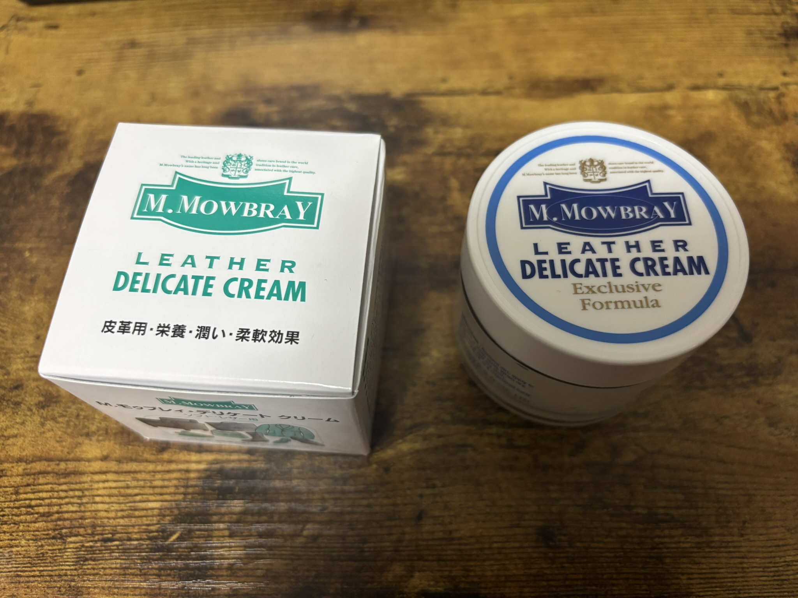
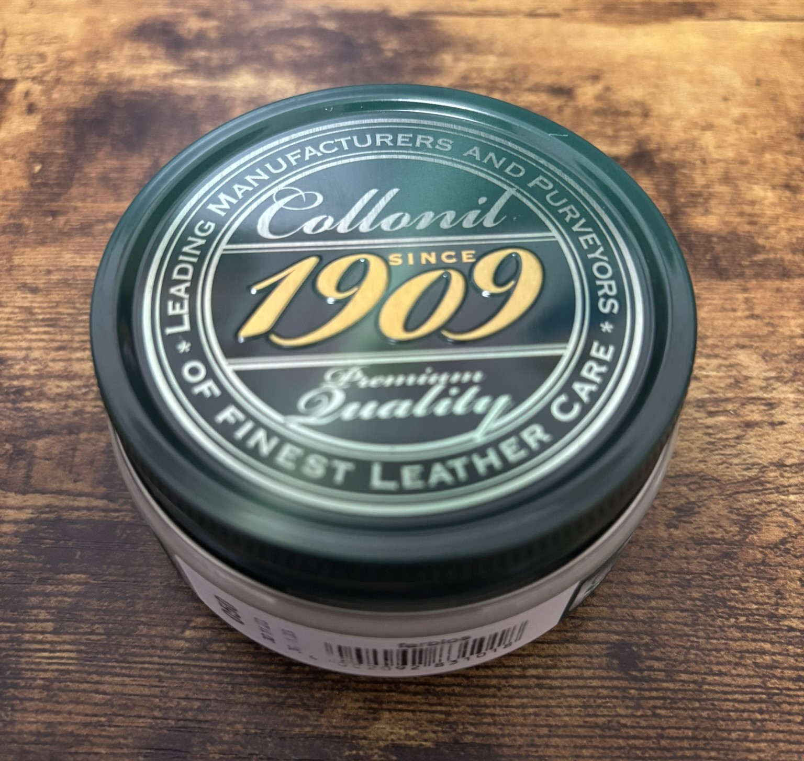
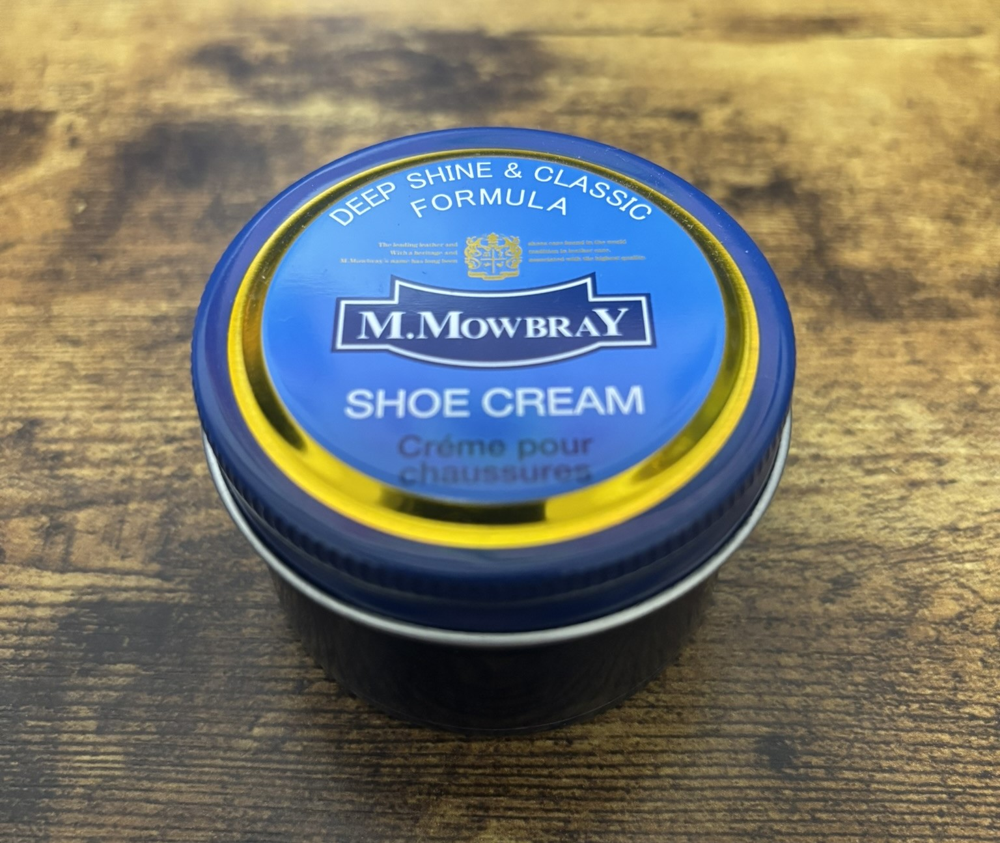
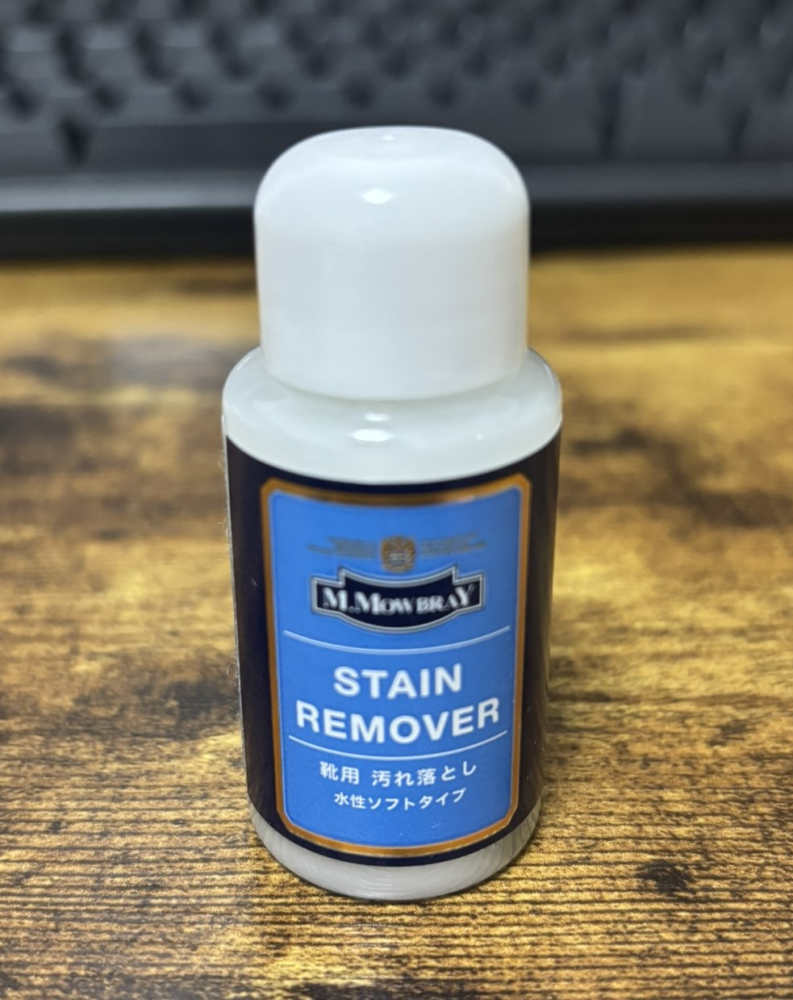

# 最近購入した革製品のメンテナンス製品

## M.MOWBRAY DELICATE CREAM

価格: 1,320円程度

革皮用・栄養・潤い・柔軟効果がある。
光沢はあまり出ないが、水分が多くうるおいが必要な革に適している。
色がつかないので汎用性が高い。

## コロニル 1909 シュプリーム クリーム デラックス

価格: 1,777円程度

シミになりにくい。革の色を補修し、しっとりする。また、少し光沢が出る。
色がつかないので汎用性が高い。撥水効果も期待できる。

## M.MOWBRAY SHOE CREAM (ブラック)

価格: 1,000円程度

靴用のクリーム。ろう、油分、有機溶剤が含まれている。
革の色を補修し、光沢が出る。黒色なので黒革に適用する。

## M.MOWBRAY STAIN REMOVER

価格: 700円程度

靴用の水性クリーナー。革の汚れを落とす。

